# Práctica 1. Conceptos fundamentales de PostgreSQL

**Autores:** Claudia Díaz González
**ALU:** alu0101482484@ull.edu.es


## 1. Creación de la base de datos

```sql
-- 1a
CREATE DATABASE biblioteca;
```

## 2. Creación de usuarios

```sql
-- 2a
CREATE ROLE admin_biblio WITH LOGIN PASSWORD 'adminpass';
CREATE ROLE usuario_biblio WITH LOGIN PASSWORD 'usuariopass';
ALTER DATABASE biblioteca OWNER TO admin_biblio;

-- 2b
CREATE ROLE lectores NOLOGIN;

-- 2c
GRANT lectores TO usuario_biblio;

-- 2b (permisos de consulta para lectores)
GRANT CONNECT ON DATABASE biblioteca TO lectores;
GRANT USAGE ON SCHEMA public TO lectores;
ALTER DEFAULT PRIVILEGES IN SCHEMA public GRANT SELECT ON TABLES TO lectores;

-- 2a (permisos de administrador para admin_biblio)
GRANT ALL ON SCHEMA public TO admin_biblio;
ALTER DEFAULT PRIVILEGES IN SCHEMA public GRANT ALL ON TABLES TO admin_biblio;
ALTER DEFAULT PRIVILEGES IN SCHEMA public GRANT ALL ON SEQUENCES TO admin_biblio;

-- 2d
SELECT rolname, rolsuper, rolcreaterole, rolcreatedb, rolcanlogin
FROM pg_roles
ORDER BY rolname;

```


```sql
-- 2e
ALTER ROLE usuario_biblio WITH PASSWORD 'nuevapass';
```

## 3. Creación de tablas

```sql
-- 3a y 3b
CREATE TABLE autores (
    id_autor     SERIAL PRIMARY KEY,
    nombre       TEXT NOT NULL,
    nacionalidad TEXT
);

CREATE TABLE libros (
    id_libro        SERIAL PRIMARY KEY,
    titulo          TEXT NOT NULL,
    año_publicacion INTEGER,
    id_autor        INTEGER NOT NULL REFERENCES autores(id_autor)
);

CREATE TABLE prestamos (
    id_prestamo         SERIAL PRIMARY KEY,
    id_libro            INTEGER NOT NULL REFERENCES libros(id_libro) ON DELETE CASCADE,
    fecha_prestamo      DATE NOT NULL DEFAULT CURRENT_DATE,
    fecha_devolucion    DATE,
    usuario_prestatario TEXT NOT NULL
);

\dt
\d prestamos

```

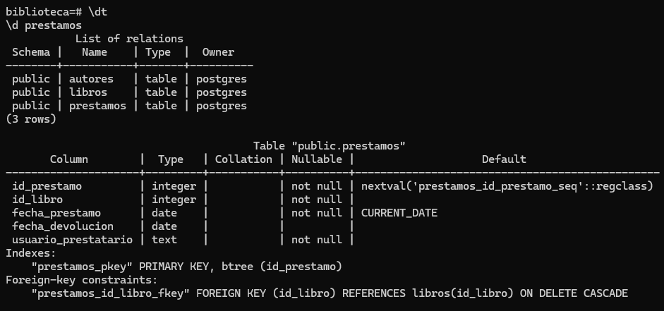

```sql

-- Permisos sobre las tablas ya creadas
GRANT SELECT ON ALL TABLES IN SCHEMA public TO lectores;
GRANT ALL ON ALL TABLES IN SCHEMA public TO admin_biblio;
GRANT ALL ON ALL SEQUENCES IN SCHEMA public TO admin_biblio;

-- 2f
REVOKE DELETE ON ALL TABLES IN SCHEMA public FROM usuario_biblio;
REVOKE DELETE ON ALL TABLES IN SCHEMA public FROM lectores;
\dp
```
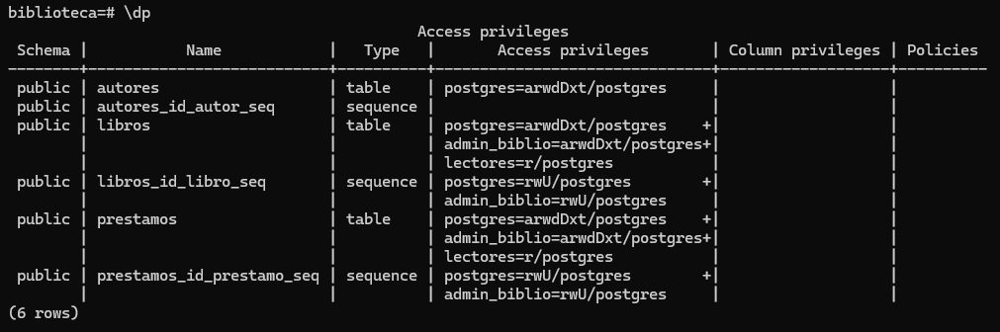

## 4. Inserción de datos

```sql
-- 4a
INSERT INTO autores (nombre, nacionalidad) VALUES
('Gabriel García Márquez', 'Colombiana'),
('Isabel Allende', 'Chilena'),
('Miguel de Cervantes', 'Española'),
('Benito Pérez Galdós', 'Española'),
('Jorge Luis Borges', 'Argentina');

INSERT INTO libros (titulo, año_publicacion, id_autor) VALUES
('Cien años de soledad', 1967, 1),
('El amor en los tiempos del cólera', 1985, 1),
('Crónica de una muerte anunciada', 1981, 1),
('La casa de los espíritus', 1982, 2),
('Eva Luna', 1987, 2),
('Don Quijote de la Mancha', 1605, 3),
('Fortunata y Jacinta', 1887, 4),
('Ficciones', 1944, 5);

INSERT INTO prestamos (id_libro, fecha_prestamo, fecha_devolucion, usuario_prestatario) VALUES
(1, '2026-09-01', '2026-09-10', 'ana_garcia'),
(1, '2026-09-12', NULL,         'carlos_perez'),
(4, '2026-09-05', '2026-09-15', 'ana_garcia'),
(6, '2026-09-10', NULL,         'lucia_martin'),
(1, '2026-08-20', '2026-08-30', 'lucia_martin'),
(4, '2026-09-15', NULL,         'carlos_perez'),
(8, '2026-09-18', NULL,         'ana_garcia'),
(2, '2026-09-01', '2026-09-08', 'carlos_perez');

SELECT * FROM autores;
SELECT * FROM libros;
SELECT * FROM prestamos;
```
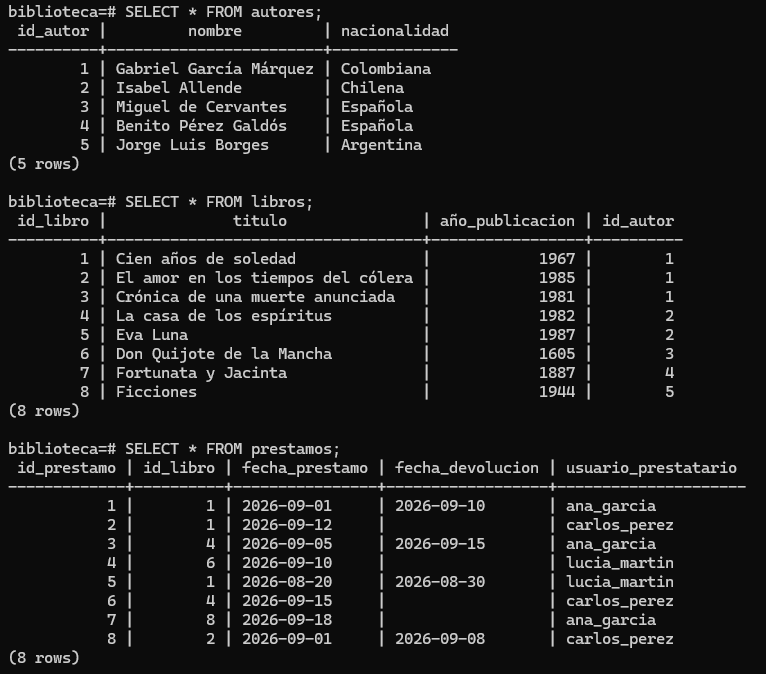

## Comprobación de permisos de usuario_biblio (2f)

```bash
psql -h localhost -U usuario_biblio -d biblioteca
```

```sql
SELECT * FROM autores;
DELETE FROM prestamos;
INSERT INTO autores (nombre) VALUES ('Prueba');
\q
```
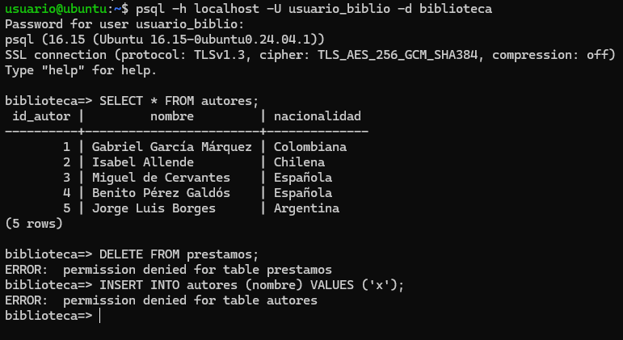

## 5. Consultas básicas

```sql
-- 5a
SELECT l.titulo, l.año_publicacion, a.nombre AS autor
FROM libros l
JOIN autores a ON a.id_autor = l.id_autor
ORDER BY a.nombre, l.titulo;

```
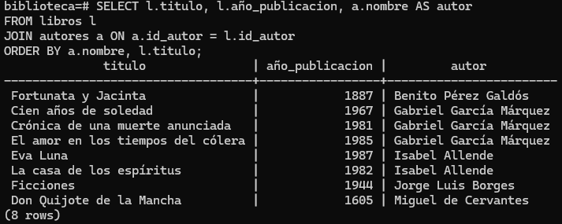
```sql
-- 5b
SELECT * FROM prestamos WHERE fecha_devolucion IS NULL;

```
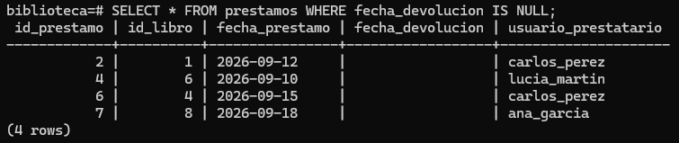

```sql
-- 5c
SELECT a.nombre, COUNT(*) AS num_libros
FROM autores a
JOIN libros l ON l.id_autor = a.id_autor
GROUP BY a.nombre
HAVING COUNT(*) > 1;
```
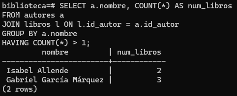
## 6. Consultas con agregación

```sql
-- 6a
SELECT COUNT(*) AS total_prestamos FROM prestamos;

-- 6b
SELECT usuario_prestatario, COUNT(*) AS libros_prestados
FROM prestamos
GROUP BY usuario_prestatario
ORDER BY libros_prestados DESC;
```
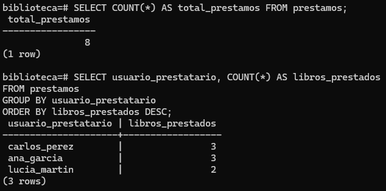

## 7. Modificación de datos

```sql
-- 7a
UPDATE prestamos
SET fecha_devolucion = CURRENT_DATE
WHERE id_prestamo = 2
RETURNING *;

```
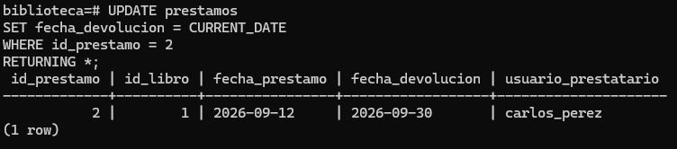

```sql
-- 7b
SELECT * FROM prestamos WHERE id_libro = 8;
DELETE FROM libros WHERE id_libro = 8;
SELECT * FROM prestamos WHERE id_libro = 8;

--> Justificación: Gracias al ON DELETE CASCADE de la tabla prestamos, al borrar el libro se eliminan automáticamente sus préstamos. Sin él, el comportamiento por defecto impediría borrar el libro y daría un error de clave foránea.
```
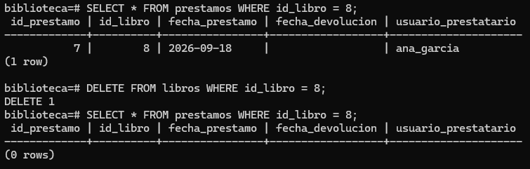

## 8. Creación de vistas

```sql
-- 8a
CREATE VIEW vista_libros_prestados AS
SELECT l.titulo, a.nombre AS autor, p.usuario_prestatario AS prestatario
FROM prestamos p
JOIN libros l  ON l.id_libro = p.id_libro
JOIN autores a ON a.id_autor = l.id_autor;

SELECT * FROM vista_libros_prestados;

```
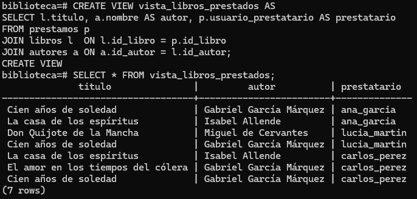


```sql

-- 8b
REVOKE ALL ON vista_libros_prestados FROM PUBLIC, lectores;
GRANT SELECT ON vista_libros_prestados TO usuario_biblio;
\dp vista_libros_prestados
```
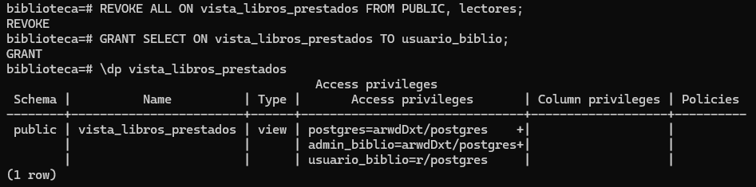


## 9. Funciones y consultas avanzadas

```sql
-- 9a
CREATE OR REPLACE FUNCTION libros_de_autor(p_nombre TEXT)
RETURNS TABLE (titulo TEXT, año_publicacion INTEGER)
LANGUAGE sql
AS $$
    SELECT l.titulo, l.año_publicacion
    FROM libros l
    JOIN autores a ON a.id_autor = l.id_autor
    WHERE a.nombre ILIKE p_nombre;
$$;

SELECT * FROM libros_de_autor('Gabriel García Márquez');

```
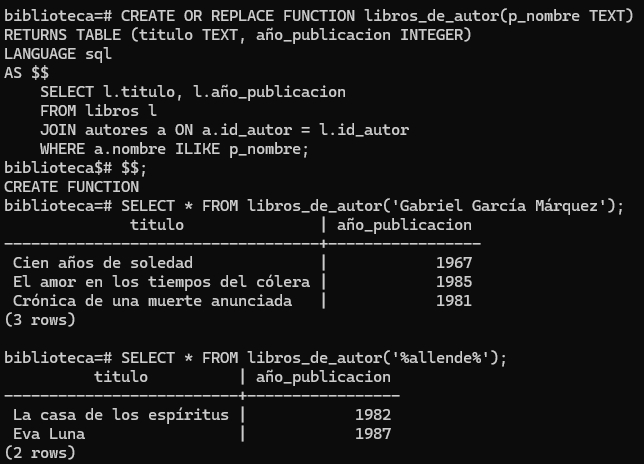


```sql

-- 9b
SELECT l.titulo, COUNT(*) AS veces_prestado
FROM libros l
JOIN prestamos p ON p.id_libro = l.id_libro
GROUP BY l.titulo
ORDER BY veces_prestado DESC, l.titulo
LIMIT 3;
```

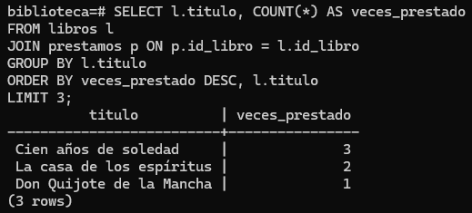


## 10. Exportación e importación de datos

```sql
-- 10a
\copy libros TO '/tmp/libros.csv' WITH (FORMAT csv, HEADER)
```

```bash
cat /tmp/libros.csv

cat > /tmp/autores_extra.csv << 'EOF'
nombre,nacionalidad
Julio Cortázar,Argentina
Mario Vargas Llosa,Peruana
Carmen Laforet,Española
EOF
```

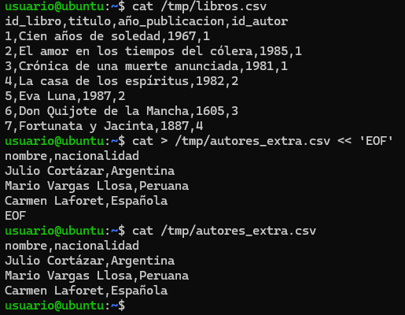

```sql
-- 10b
\copy autores(nombre, nacionalidad) FROM '/tmp/autores_extra.csv' WITH (FORMAT csv, HEADER)
SELECT * FROM autores;
```
