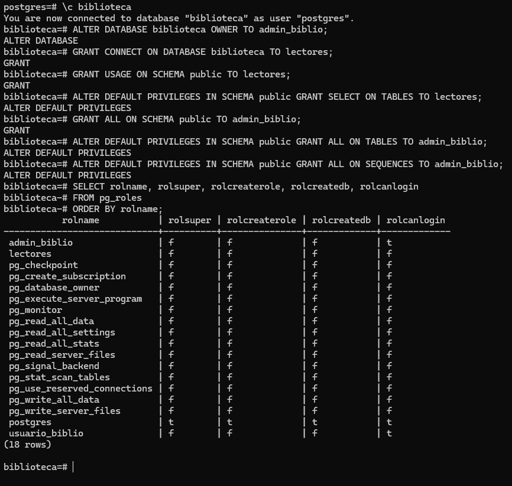

# Práctica 1. Conceptos fundamentales de PostgreSQL

**Autores:** Claudia Díaz González
**ALU:** alu0101482484@ull.edu.es


## 1. Creación de la base de datos

```sql
-- 1a
CREATE DATABASE biblioteca;
```

## 2. Creación de usuarios

```sql
-- 2a
CREATE ROLE admin_biblio WITH LOGIN PASSWORD 'adminpass';
CREATE ROLE usuario_biblio WITH LOGIN PASSWORD 'usuariopass';
ALTER DATABASE biblioteca OWNER TO admin_biblio;

-- 2b
CREATE ROLE lectores NOLOGIN;

-- 2c
GRANT lectores TO usuario_biblio;

-- 2b (permisos de consulta para lectores)
GRANT CONNECT ON DATABASE biblioteca TO lectores;
GRANT USAGE ON SCHEMA public TO lectores;
ALTER DEFAULT PRIVILEGES IN SCHEMA public GRANT SELECT ON TABLES TO lectores;

-- 2a (permisos de administrador para admin_biblio)
GRANT ALL ON SCHEMA public TO admin_biblio;
ALTER DEFAULT PRIVILEGES IN SCHEMA public GRANT ALL ON TABLES TO admin_biblio;
ALTER DEFAULT PRIVILEGES IN SCHEMA public GRANT ALL ON SEQUENCES TO admin_biblio;

-- 2d
SELECT rolname, rolsuper, rolcreaterole, rolcreatedb, rolcanlogin
FROM pg_roles
ORDER BY rolname;


-- 2e
ALTER ROLE usuario_biblio WITH PASSWORD 'nuevapass';
```

